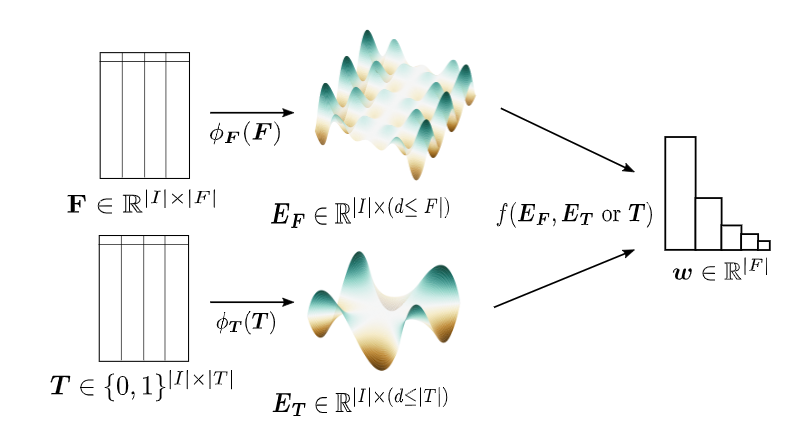

# ReliefE: Feature Ranking via Manifold Embeddings
Welcome to the official implementation sites of ReliefE.
This repository hosts the ReliefE idea, suitable both for _multiclass_ and _multilabel_ classification problems.


## Getting started
To install stable ReliefE, try:
```
pip install reliefe
```

To install the bleeding-edge repo version, you can also
```
pip install git+https://github.com/SkBlaz/reliefe
```

Required dependencies can be installed via
```
pip install -r requirements.txt
```

## Tests
An important check after each installation are the *tests*. To verify ReliefE works OK on your hardware, please go to "tests" folder, and input:
```
py.test (if using pytest-sugar)
python -m pytest * (otherwise)
```

## Documentation and examples
Please visit the docs pages to get started!
